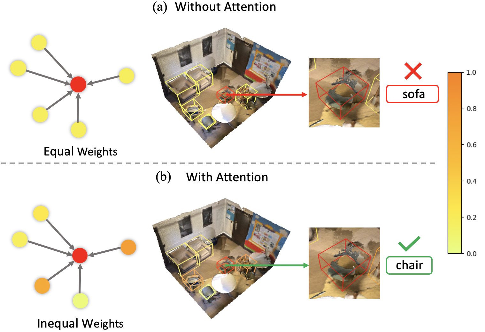

# ARM3D:  Attention-based Relation Module for Indoor 3D Object Detection

## Introduction

<div align=center>

</div>

ARM3D is a plug-and-play module which can be conveniently applied to different 3D object detectors. It provides precise and useful relation context to help 3D detectors locate and classify objects more accurately and robustly. We implement two applications on VoteNet and MLCVNet. We e valuate its improved performance on ScanNetV2 and SUN RGB-D dataset. ARM3D can be widely applicable on different 3D detection frameworks. This is the application of VoteNet+ARM3D, which is VoteNet equipped with relation module ARM3D code implementation on ScanNet dataset and sunrgbd dataset.

## Installation

Please follow the [Installation](https://github.com/facebookresearch/votenet#installation) and [Data preparation](https://github.com/facebookresearch/votenet#data-preparation) structions in VoteNet. Make sure that your data structure is correct and the same as VoteNet.

## Demo

Once you install the environment, it is convenient to run the demo of VoteNet+ARM3D on ScanNet without data preparation:

```
python demo.py --model votenet_ARM3D --scene_name scene0609_02 (option: --pc_root /YOUR_DATA_ROOT/scannet/ --npy_root ./scannet/scannet_train_detection_data/)
```

If you want to try more scenes, please prepare the same data required as in ./demo_files/ and change the scene_name. Moreover, it is also available to prepare the full dataset and use the option commands to run our method on the scene you prefer. The output pred boxes and ground truth boxes are under ./detection_vis/*scene_name*/. To visualize the results, softwares like MeshLab are ideal.

## Train and Test

### Train and test on ScanNet

To train a model on Scannet data, you can simply run (it takes around 4 hours to convergence with one TITAN V GPU):

```
python train.py --dataset scannet --log_dir log_scannet --num_point 40000 --gpu 0
```

To test the trained model with its checkpoint:

```
python eval.py --dataset scannet --checkpoint_path log_scannet/CHECKPOINT_PATH.tar --dump_dir eval_scannet --num_point 40000 --cluster_sampling seed_fps --use_3d_nms --use_cls_nms --per_class_proposal --gpu 0
```

### Train and test on Sunrgbd

To train a new VoteNet model on SUN RGB-D data:

```
python train.py --dataset sunrgbd --log_dir log_sunrgbd --gpu 0
```

To test the trained model with its checkpoint:

```
python eval.py --dataset sunrgbd --checkpoint_path log_sunrgbd/CHECKPOINT_PATH.tar --dump_dir eval_sunrgbd --cluster_sampling seed_fps --use_3d_nms --use_cls_nms --per_class_proposal --gpu 0
```

## Acknowledgemets

This code largely benefits from excellent works [PointCNN](https://github.com/yangyanli/PointCNN) and [VoteNet](https://github.com/facebookresearch/votenet) and repositories, please also consider cite and [VoteNet](https://arxiv.org/pdf/1904.09664.pdf) if you use this code.
